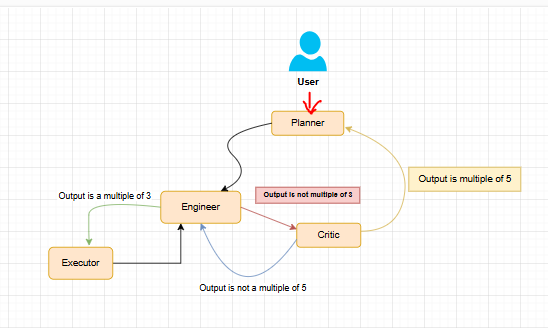
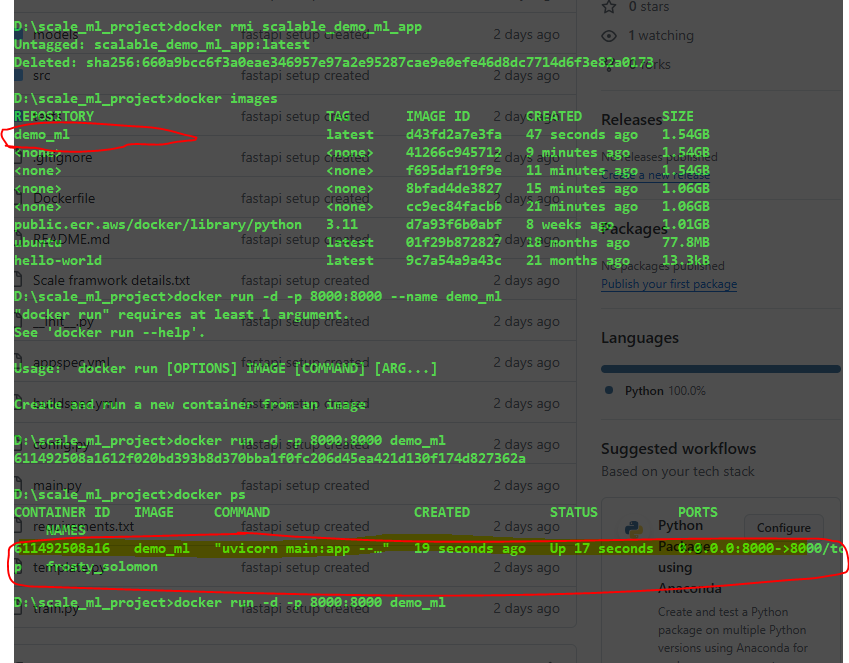
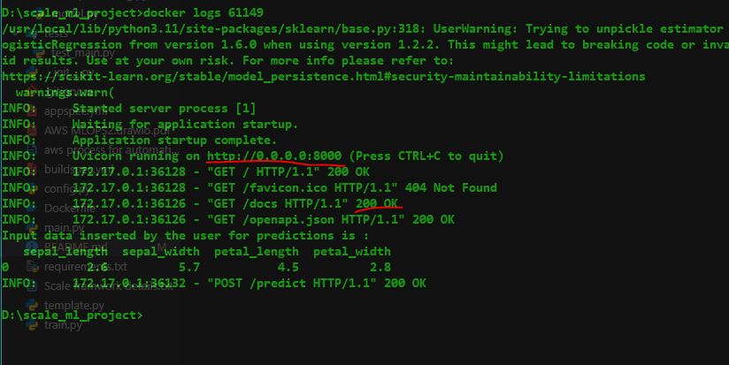

# scale_project1_mlops

This project is based on SCALE frameworks, which uses AWS services such as, codebuild, codepipeline, s3bucker, ECR, EC2 instances, it also uses docker

# Poject workflow

# Docker test

